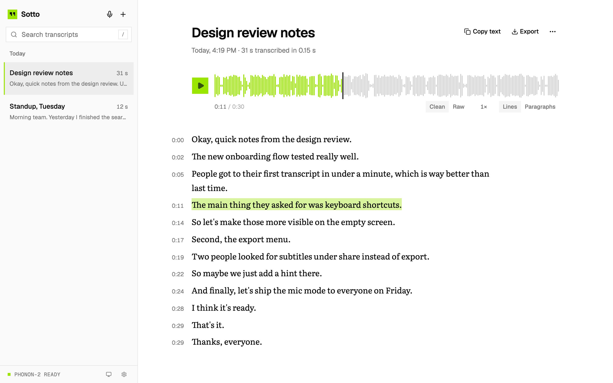
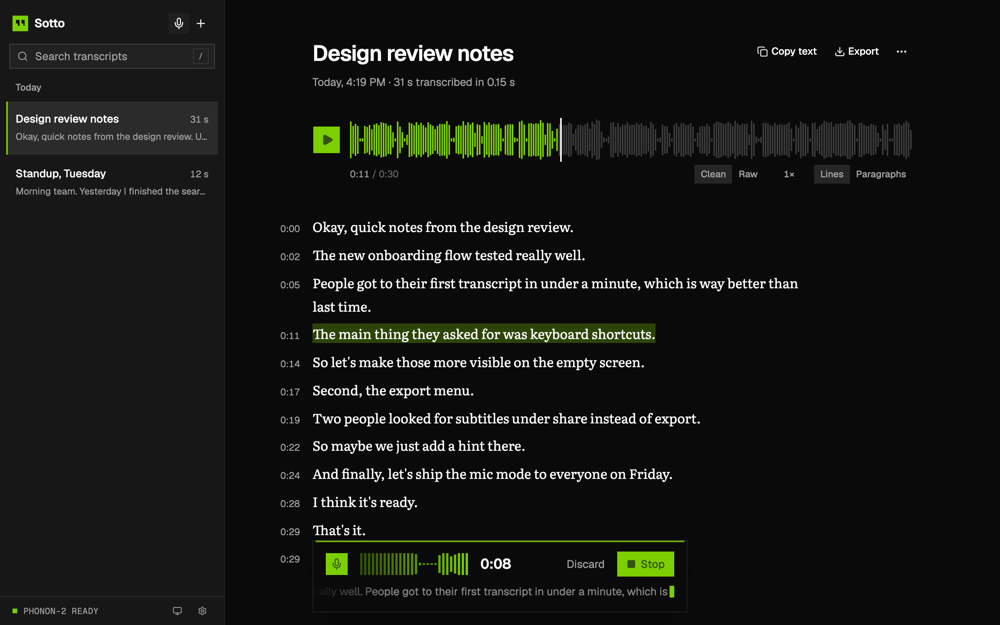
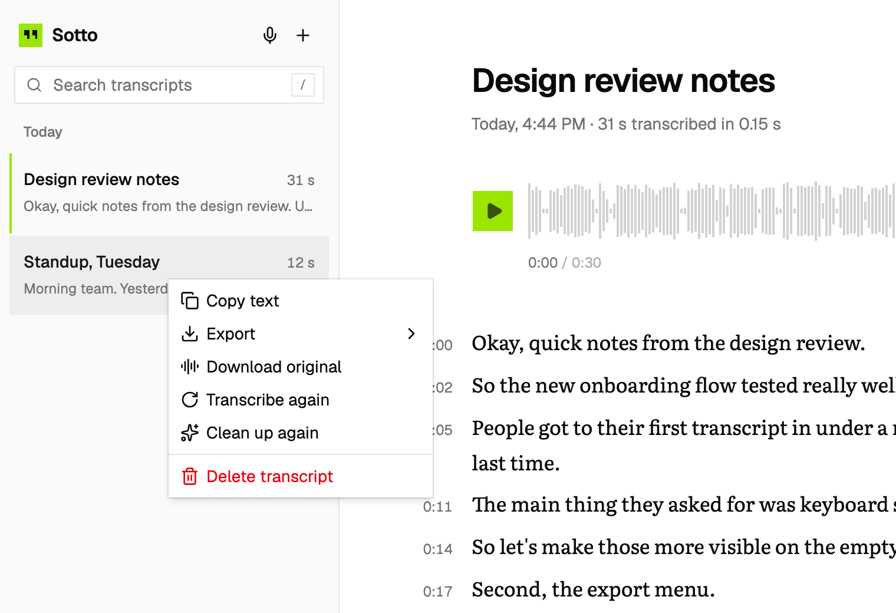
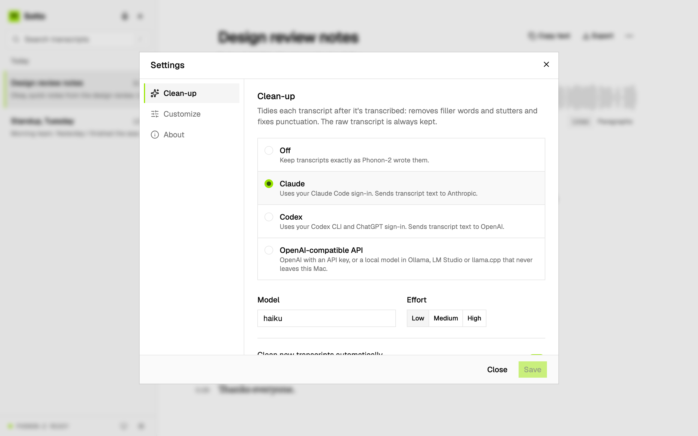

# Sotto

**Fast, private transcription and dictation for your Mac.**

Drop in a recording, or hold <kbd>M</kbd> and talk. [Phonon-2](https://www.fermionresearch.com/research/phonon-2/) transcribes it on your Mac's GPU in seconds, and Sotto keeps every transcript searchable, playable and exportable. Your audio never leaves your Mac.

*Sotto* comes from *sotto voce*, "in a quiet voice".



## Highlights

- **Fast:** a 16-minute recording is ready in about 4 seconds; a short voice note, before you've let go of the key.
- **Any file:** mp3, m4a, wav, flac, ogg, opus, mp4, mov, webm, and anything else ffmpeg reads, video included.
- **Dictation:** hold <kbd>M</kbd> to talk, or double-tap it for hands-free, with a live transcript as you speak.
- **Read along:** sentence-by-sentence timestamps, the current sentence highlighted, and click-to-seek.
- **Search and export:** full-text search, then copy or export text, Markdown, SRT, WebVTT or the original recording.
- **Optional clean-up:** remove filler words and stutters with Claude, Codex, OpenAI or a local model. The raw text is always kept.
- **Private:** runs locally on Apple silicon, with no accounts and no telemetry.

## Install

You need a Mac with Apple silicon (M1 or later), [Homebrew](https://brew.sh) and about 1 GB of free space.

```sh
curl -fsSL bldr.sh/sotto | bash
```

This downloads Sotto into `~/.sotto` and runs its installer. ([Read the script](scripts/setup.sh) first if you like.) If you'd rather clone it yourself:

```sh
git clone https://github.com/siddharthborderwala/sotto.git
cd sotto
./scripts/install.sh
```

The installer:

- sets up Bun, ffmpeg and the speech engine (Fermion's `phonon` CLI, plus the 164 MB Phonon-2 model);
- if Claude Code or Codex is installed, asks whether you'd like clean-up (the default is no);
- starts Sotto in the background, where it stays running and starts at login.

It doesn't need your password. Then open **http://localhost:8011**.

To use Sotto like an app, open it in Safari and choose **File → Add to Dock**, or in Chrome or Edge choose **Install Sotto** from the address bar.

To update, run the same one-liner again (or `./scripts/update.sh` in your copy). To remove Sotto's services, run `~/.sotto/scripts/uninstall.sh` (or `./scripts/uninstall.sh` in your copy); your transcripts are kept.

<details>
<summary><b>Optional: serve Sotto at your own HTTPS name</b></summary>

To use a name such as `https://sotto.example.com` instead of `localhost`:

```sh
SOTTO_HOST=sotto.example.com ./scripts/install.sh
```

This asks for your password once. It points the name at this Mac in `/etc/hosts` (so no DNS is involved), serves it over HTTPS with [Caddy](https://caddyserver.com), and trusts Caddy's local certificate. Nothing is published to the internet. The setting is remembered, so later updates keep it.

</details>

## Using Sotto

**Add recordings.** Drop files anywhere in the window, paste them with <kbd>⌘V</kbd>, or click **+**. Several files are transcribed one after another, and the sidebar shows their progress.

**Dictate.** Hold <kbd>M</kbd> and talk; let go to save. Double-tap <kbd>M</kbd> to keep recording hands-free, then press <kbd>M</kbd> again or click **Stop**. The mic button in the sidebar starts hands-free too. While you speak, a floating bar shows the live transcript, a level meter and a timer. The saved recording goes through the same pipeline as a dropped file, and a recording with no speech in it is discarded.



**Read and listen.**
- The waveform is the scrubber. As audio plays, the current sentence is highlighted; click any sentence or timestamp to jump there.
- Above the text you can switch **Clean** / **Raw** (when cleaned), **Lines** / **Paragraphs**, and the playback speed.
- Click the title to rename a transcript.

**Find and reuse.**
- <kbd>/</kbd> searches every title and transcript.
- Right-click a transcript in the sidebar to copy, export, download the original, transcribe or clean up again, or delete it.
- Select several with <kbd>⌘</kbd>-click or <kbd>Shift</kbd>-click and the menu acts on all of them. Copies are joined under their titles, and exports download as one zip.



### Keyboard shortcuts

| Keys | Action |
|---|---|
| <kbd>M</kbd> (hold) · <kbd>M</kbd> <kbd>M</kbd> | Dictate · dictate hands-free |
| <kbd>/</kbd> | Search |
| <kbd>J</kbd> <kbd>K</kbd> or <kbd>Shift</kbd> <kbd>→</kbd> <kbd>←</kbd> | Next · previous transcript |
| <kbd>Space</kbd> | Play · pause |
| <kbd>←</kbd> <kbd>→</kbd> | Back · forward 5 seconds |
| <kbd>⌘C</kbd> (nothing selected) | Copy the transcript |
| <kbd>⌘V</kbd> | Add files from the clipboard |
| <kbd>⌘A</kbd> · <kbd>Esc</kbd> | Select all · clear the selection |
| <kbd>⌘⌫</kbd> | Delete the selected transcripts |
| <kbd>⌘,</kbd> | Settings |

## Settings

Open Settings with the gear in the sidebar or <kbd>⌘,</kbd>.



### Clean-up

Clean-up tidies a transcript after it's transcribed: it removes filler words ("um", "you know"), stutters and false starts, and fixes punctuation, without changing what was said. Each sentence is cleaned in place, so timestamps and playback still line up. It's off by default.

| Provider | Default model | Where the text goes |
|---|---|---|
| **Off** | | Nowhere. Transcripts stay as Phonon-2 wrote them. |
| **Claude** | `haiku` | To Anthropic, through your [Claude Code](https://claude.com/claude-code) sign-in. No API key needed. |
| **Codex** | `gpt-6-luna` | To OpenAI, through your [Codex CLI](https://github.com/openai/codex) sign-in. No API key needed. |
| **OpenAI-compatible API** | (you choose) | To the API you point it at. With [Ollama](https://ollama.com), [LM Studio](https://lmstudio.ai), llama.cpp or `fermion serve` (presets included), it never leaves your Mac. With OpenAI, it needs your API key. |

- **What's sent:** only the text, never the audio.
- **Model and effort:** Claude and Codex let you choose both.
- **Timing:** new transcripts are cleaned automatically unless you turn that off; you can always use **Clean up again** from a transcript's menu.
- **Checking a setup:** **Test with a sample** runs your settings on a sample sentence before you save.

### Customize

These apply instantly and are saved in your browser.

- **Theme:** System, Light or Dark.
- **Transcript text:** show, copy and export the Clean or Raw version.
- **Transcript display:** Lines or Paragraphs.
- **Default playback speed:** 1×, 1.25×, 1.5× or 2×. Every transcript starts at this speed.

### About

The engine's status, Sotto's address, where your library is, and the version.

## Privacy

- Your recordings and transcripts are stored only on your Mac, in `~/Library/Application Support/sotto`.
- Transcription runs locally. Text leaves your Mac only if you choose a hosted clean-up provider.
- There are no accounts, analytics or telemetry.
- Sotto listens only on `127.0.0.1` and refuses requests from other websites, so pages you visit can't read or change your library. See [SECURITY.md](SECURITY.md).

## Files and advanced settings

| Path | What |
|---|---|
| `~/Library/Application Support/sotto/` | Your library: `sotto.db` (SQLite) and `media/` (the original recordings), plus `config.env`. Back up this folder. |
| `~/Library/Logs/sotto/` | `engine.log` and `web.log` |
| `~/.cache/fermion/` | The Phonon-2 model |

`config.env` holds the settings the installer and the Clean-up page save. You can also set them as environment variables when running the installer, or edit the file and restart the web service.

| Setting | Default | |
|---|---|---|
| `SOTTO_PORT` | `8011` | Sotto's port on this Mac. |
| `SOTTO_ENGINE_PORT` | `8010` | The speech engine's port. |
| `SOTTO_HOST` | none | Optional HTTPS name (see Install). |
| `SOTTO_CLEANUP` | `off` | `off`, `claude`, `codex` or `openai` |
| `SOTTO_CLEANUP_AUTO` | `on` | Clean new transcripts automatically. |
| `SOTTO_CLEANUP_MODEL`, `_EFFORT`, `_URL`, `_API_KEY` | | Clean-up provider details. |

Re-run `./scripts/install.sh` after changing a port or the host.

## Troubleshooting

- **"Engine offline" in the sidebar:** the speech engine is starting (the first start compiles GPU shaders, about 20 seconds) or has stopped. Check `~/Library/Logs/sotto/engine.log`, or restart it with `launchctl kickstart -k gui/$(id -u)/com.sotto.engine`. Files you add in the meantime wait and are transcribed once it's back.
- **The microphone doesn't work:** allow microphone access for Sotto in your browser's site settings. Dictation needs `localhost` or HTTPS.
- **The page doesn't load:** check that the services are running with `launchctl list | grep sotto`, and look at `~/Library/Logs/sotto/web.log`. Re-running `./scripts/install.sh` fixes most problems.
- **A port is already in use:** install with a different one, e.g. `SOTTO_PORT=8021 ./scripts/install.sh`.
- **Clean-up failed:** the reason is shown on the transcript. In Settings, **Test with a sample** checks your provider. Claude and Codex need to be signed in: run `claude` once, or `codex login`.

## Contributing

Contributions are welcome. [CONTRIBUTING.md](CONTRIBUTING.md) covers the architecture, the API and how to run Sotto in development.

## Credits

Speech recognition is [Phonon-2](https://www.fermionresearch.com/research/phonon-2/) by Fermion Research (model under CC BY 4.0, engine under Apache 2.0). Sotto is built with [Bun](https://bun.sh), [Hono](https://hono.dev), [React](https://react.dev), [shadcn/ui](https://ui.shadcn.com) on [Base UI](https://base-ui.com), [Tailwind CSS](https://tailwindcss.com) and [ffmpeg](https://ffmpeg.org), and set in Geist and Literata. See [NOTICE](NOTICE) for licenses.

## License

[MIT](LICENSE). Sotto is free.
